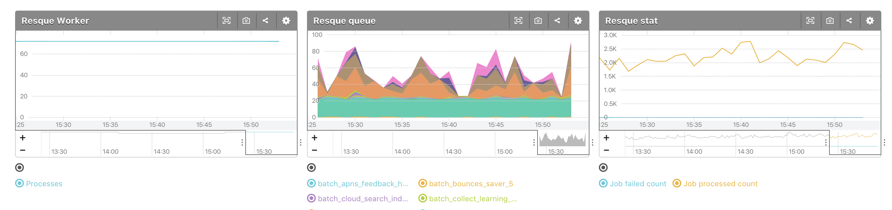

# mackerel-plugin-resque
Mackerel plugin for Resque

## Install

You can install this plugin via `mkr plugin install`

```console
$ mkr plugin install rmanzoku/mackerel-plugin-resque
```

## Usage

```
Usage of ./mackerel-plugin-resque:
  -db int
	  Redis db
  -host string
	  The bind url to use for the redis server (default "127.0.0.1")
  -metric-key-prefix string
	  Metric key prefix (default "resque")
  -namespace string
	  Redis key prefix (default "resque")
  -password string
	  Password for the redis server
  -port string
	  The bind port to use for the redis server (default "6379")
  -tempfile string
	  Temp file name
```

## Example mackerel-agent.conf

```
# for local Redis
[plugin.metrics.resque]
command = "/opt/mackerel-agent/plugins/bin/mackerel-plugin-resque"

# for Amazon ElastiCache
[plugin.metrics.resque]
command = "/opt/mackerel-agent/plugins/bin/mackerel-plugin-resque -host=redis-cluster.asdfgh.0001.apne1.cache.amazonaws.com"
custom_identifier = "redis-cluster.asdfgh.0001.apne1.cache.amazonaws.com"
```

## Screenshot

